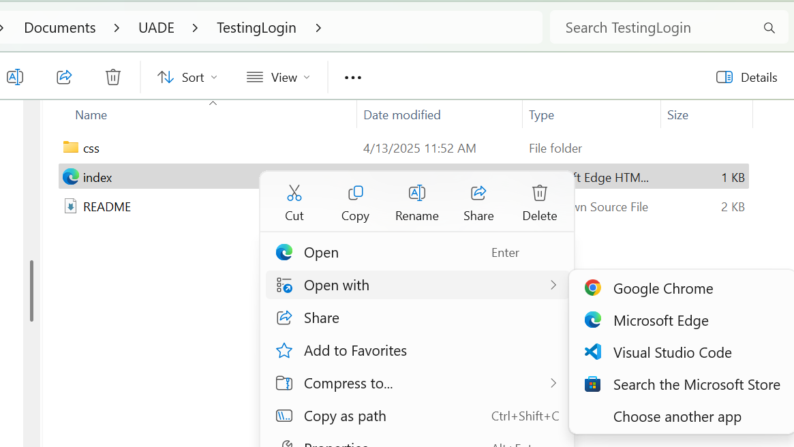
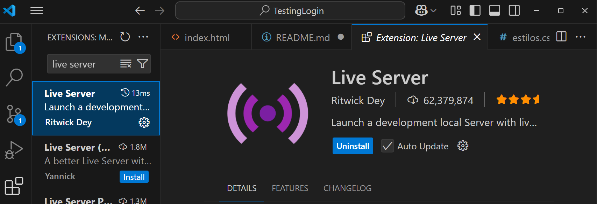
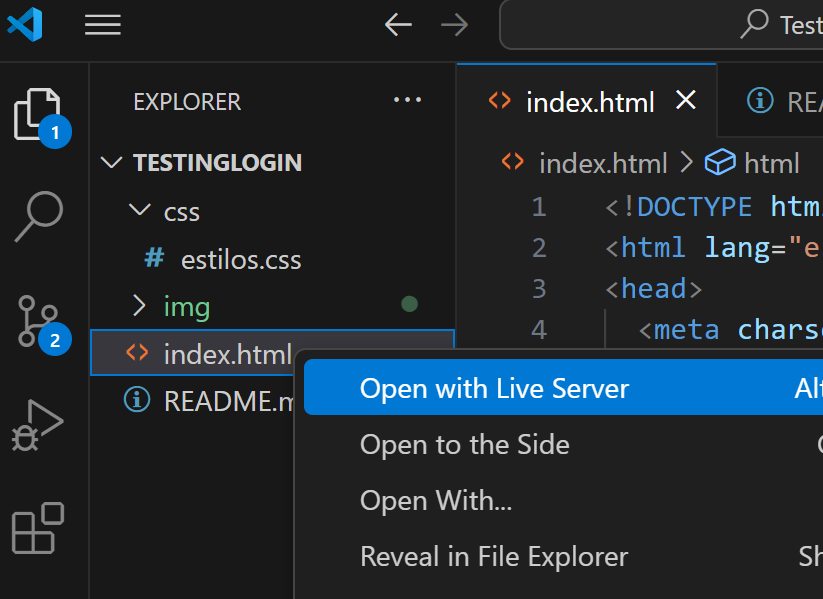

# TestingLogin

## ▶️ Cómo ejecutar el proyecto

### ✅ Opción 1: Abrir directamente en el navegador

1. Abrí la carpeta del proyecto.
2. Hacé doble clic en el archivo `index.html`.
3. Se abrirá automáticamente en tu navegador por defecto.

> ⚠️ Esto funciona perfecto para proyectos simples. Cuando empecemos a usar rutas más complejas con JavaScript que necesita un servidor, puede haber limitaciones.

---

### ✅ Opción 2: Usar un servidor local con Visual Studio Code

1. Abrí la carpeta del proyecto con **Visual Studio Code**.
2. Instalá la extensión **Live Server**:
   - Hacé clic en el ícono de extensiones en la barra lateral.
   - Buscá `Live Server` y hacé clic en “Instalar”.

3. Abrí el archivo `index.html`.
4. Hacé clic derecho en el editor y seleccioná **“Open with Live Server”**.

5. Tu navegador se abrirá automáticamente con la página, y se actualizará cada vez que guardes cambios.

> 💡 Esta es la opción recomendada para desarrollo, porque te permite ver los cambios en tiempo real.
